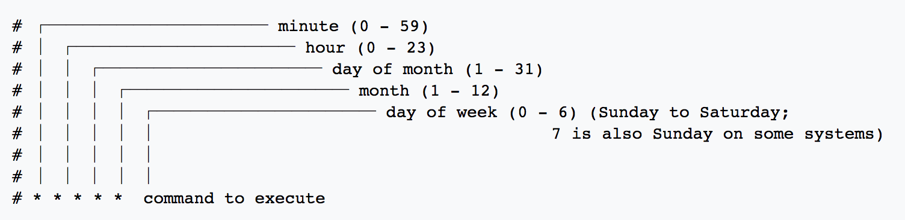

## job

### parallel job
Q: Create a Job that run 60 time with 2 jobs running in parallel
```
apiVersion: batch/v1
kind: Job
metadata:
    name: pi
spec:
    completions: 10
    parallelism: 2
    activeDeadlineSeconds: 2
    template:
    metadata:
        name: pi
    spec:
        containers:
        - name: pi
        image: perl
        command: ["perl",  "-Mbignum=bpi", "-wle", "print bpi(2000)"]
        restartPolicy: Never
```

kubectl scale job

参考:
https://kubernetes.io/docs/concepts/workloads/controllers/jobs-run-to-completion/


## cron job



如果某一位为*/5 就表示每隔5x； 比如在min位的话，代表每隔5分钟


## kuberctl top

Q:
```
Q: Find which Pod is taking max CPU
Use kubectl top to find CPU usage per pod
```

A:
```
 kubectl top pods | awk '{print $1 "\t" $2|"sort -r -n"}'
static-web	0m
redisljj-redis-9c7b55d58-2rt2w	2m
nginxtest-7b46d4c47f-z8h6m	0m
nginxtest-7b46d4c47f-nbgff	0m
nginxtest-7b46d4c47f-mvrg6	0m
nginxtest-7b46d4c47f-dhjxp	0m
nginx-ingress-controller-75cd585bbc-glzdr	3m
nginx-deployment-75675f5897-qmh8k	0m
nginx-deployment-75675f5897-htwrc	0m
nginx-deployment-75675f5897-97kv6	0m
nginx2	0m
nginx	0m
nfs-client-provisioner-6db86bc775-lb945	1m
NAME	CPU(cores)
mysql-mysql-59497c8745-28pk8	2m
kkk-mysql-84b98dd45d-c6nvf	2m
jenkins-0	2m
java-jenkins-759844d47d-mvhlv	1m
java-acloud-nginx-ddffdd664-vqds4	0m
java-acloud-nginx1-796c5cdc4d-sfb4f	0m
foo-868b7bcc9b-ldmsb	0m
foo-868b7bcc9b-7rgfc	0m
foo-868b7bcc9b-78hwj	0m
devportal-web-b8645fdfc-tjk4r	0m
default-http-backend-858d89f5c8-kcs6q	0m
counter	1m
acloud-zuul-56f68bd84-mccpc	7m
acloud-ui-7b6cf97b54-lgkjs	1m
acloud-oauth-679b9db65d-jc82j	4m
acloud-eureka-79cf669cb5-6g4hc	0m
acloud-devmanage-c85cf748b-9ljv6	6m
acloud-config-86c8d9d94f-64bcf	9m
acloud-authority-68f59566-sbnvw	9m
acloud-admin-59cd47d696-gfmsb	1m
```
